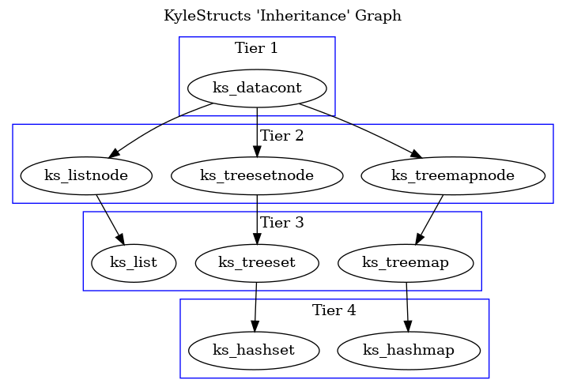

# KyleStructs
This is a C library I wrote to satisfy my own curiosity as to how simple data structures like tree sets and hash maps might be implemented. My goal has been to design and write everything as clearly and logically as possible while maintaining effiency.

The documentation for each data structure is located in its respective header file in `src/include/`.

## Demo
Here is a quick example of how KyleStructs might be used:

```c
/* gcc main.c -lkylestructs */

#include <stdio.h>
#include <kylestructs.h>

int main()
{
  hashmap* phonebook = hashmap_new(CHARP, 10);
  datacont* number_dc;
  datacont* name_dc;

  char number[30] = {0};
  char name[30] = {0};
  
  printf("Enter a name followed by a 10-digit phone number:\n");

  while (1) {
    if (scanf("%s %s", name, number) == -1)
      break;

    datacont* number_dc = datacont_new(number, CHARP, strlen(number)+1);
    datacont* name_dc = datacont_new(name, CHARP, strlen(name)+1);

    memset(number, 0, 30);
    memset(name, 0, 30);

    if (hashmap_add(phonebook, number_dc, name_dc) == 1)
      printf("Replaced existing number %s.\n", number);
  }

  int count = hashmap_count(phonebook);

  list* numbers = hashmap_keys(phonebook);
  list* names = hashmap_values(phonebook);

  for (int i = 0; i < count; i++)
  {
    number_dc = list_get(numbers, i);
    name_dc = list_get(names, i);

    printf("%s => %s\n", number_dc->cp, name_dc->cp);

    datacont_delete(number_dc);
    datacont_delete(name_dc);
  }

  hashmap_delete(phonebook);
  list_delete(numbers);
  list_delete(names);
}
```

## Library Overview
At the center of all of these different data structures is the `datacont` struct. It is a container that can hold pretty much any primitive data type, and comes with a library for comparison, duplication, hashing, and more. All other structures are built on top of the `datacont` struct so that they in turn can handle most kinds of data. As the design for each structure grows more complex, functionality is borrowed from one or more of those that are less complex. Here is a graph to illustrate the order of "inheritance":



## Build and Install
```sh
$ git clone https://github.com/krglaws/KyleStructs
$ cd KyleStructs
$ make
$ sudo make install
```

## Contributing
If you would like to contribute, feel free to fork this repository and submit a pull request. Be sure to add to or change the existing tests to reflect your changes.

_Images generated using [Graphviz](https://www.graphviz.org/)_
## To Do:
- write toString functions for each structure
- write toDotFile functions for each structure
- write set operation functions (e.g. union, intersection, difference, comparison, etc.)
